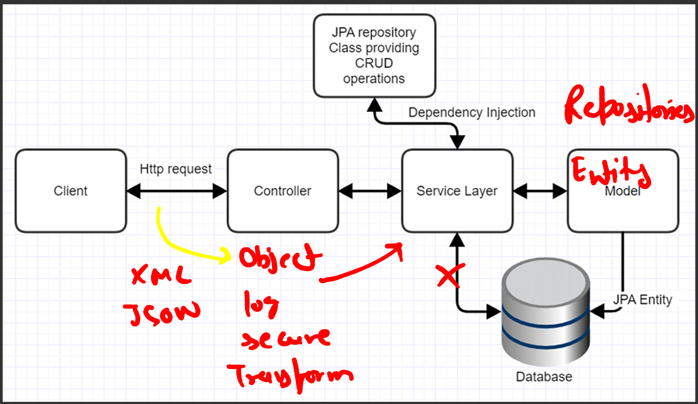
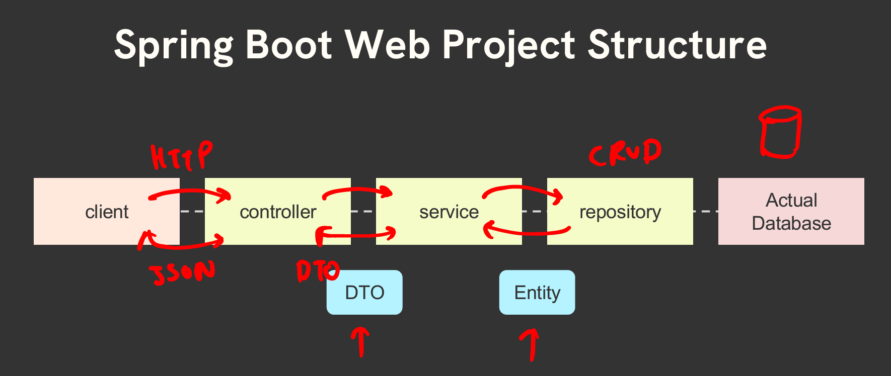

# 🚀 Coding Shuttle: Week 2 - Build Set of API's for Engineering Department!
The following was discovered as part of building this project:

* The original package name 'com.codingshuttle.w2p2.department.w2p2-department' is invalid and this project uses 'com.codingshuttle.w2p2.department.w2p2_department' instead.

# 📚 Topics Covered in Week 2
1. Spring boot web and MVC Architecure
2. Presentation Layer
3. Persistence Layer
4. Service Layer
5. Exception Handling in Spring Boot MVC
6. Input Validation Annotations

# Topic 1 - Introduction to Spring MVC Architecture
* Backend consists of APIs, webservices and Databases
* There are multiple standards for APIs - RESTFul, SOAP, WebSockets
* REST - Rest stands for (Representational State Transfer) APIs are set of rules and conventions for building and interacting with web services. REST API's are stateless.

## REST Methods -
- GET /users: Retrieve a list of all users.
- GET /users/{id}: Retrieve a specific user by ID.
- POST /users: Create a new user.
- PUT /users/{id}: Update an existing user by ID.
- PATCH /users/{id}: Partially update an existing user by ID.
- DELETE /users/{id}: Delete a user by ID.

## MVC (MVC Architecture)
In Spring Boot, the Model-View-Controller (MVC) architecture is a design pattern that separates an application into three interconnected components, promoting organized and maintainable code. Here's a brief overview of each layer and its significance:
- **`Model:`** Represents the application's data and business logic. It manages the data, logic, and rules of the application, ensuring that the data is accurate and up-to-date.
- **`View:`** Handles the presentation layer, rendering the data from the model in a user-friendly format. It is responsible for displaying the data to the user and capturing user input.
- **`Controller:`** Acts as an intermediary between the Model and View. It processes user inputs, updates the model, and determines the appropriate view to display.

By adhering to the MVC pattern, Spring Boot applications achieve a clear separation of concerns, making the codebase more modular, easier to maintain, and scalable.



## Layered Architecture
- **`Presentation Layer:`** Handles the user interface and user interactions, presenting information to users and capturing user input. This includes Authenctication & JSON Translation.
- **`Business Layer:`** Implements the core functionality and rules that drive the business processes and operations. This includes Business Logic, Validation, & Authorisation.
- **`Persistence layer:`** Handles the storage & retrieval of data from databases. This includes Storage logic and JPQL (Java Persistance Queries Language).
- **`Database layer:`** Stores, maintains, and manages data structurally and organizationally.



# Topic 2 - The Presentation Layer, DTO & Controllers

### DispatcherServlet
In Spring MVC, a single servlet known as the Dispatcher Servlet handles all incoming requests (front controller). A design pattern used in the creation of web applications is the front controller. All requests are received by a single servlet, which then distributes them to every other part of the program.

### Annotated Controllers
Spring MVC provides an annotation-based programming model where @Controller and @RestController components use annotations to express request mappings, request input, exception handling, and more. 

The @RestController annotation is a shorthand for @Controller and @ResponseBody, meaning all methods in the controller will return JSON/XML directly to the response body.

## Request Mappings
The **`@RequestMapping`** annotation in Spring Boot is used to map incoming HTTP requests to specific controller methods. It offers various attributes to fine-tune request matching based on:
- URL patterns
- HTTP methods
- Request parameters
- Headers
- Media types

For convenience, Spring Boot provides HTTP-method-specific shortcuts to @RequestMapping:
- **`@GetMapping`** for HTTP GET requests
- **`@PostMapping`** for HTTP POST requests
- **`@PutMapping`** for HTTP PUT requests
- **`@DeleteMapping`** for HTTP DELETE requests
- **`@PatchMapping`** for HTTP PATCH requests

These shortcuts simplify the code and make it more readable by directly reflecting the HTTP method they handle.

## Dynamic URL Paths

There are 2 ways of passing request data to a Get mapper. 

1. **`@PathVariable`** - This annotation is used to retrieve data from the URL path.

```java 
    // If path variable is same as variable name.
     @GetMapping(path="employeeId")
     public Employee getEmployeeId(@PathVariable Long employeeId);
```

```java
    // If path variable is different from variable name.
    @GetMapping(path="employeeId")
    public Employee getEmployeeId(@PathVariable(name = "employeeId") Long id);
```

```java 
    // If path variable is optional.
    @GetMapping(path="employeeId")
    public Employee getEmployeeId(@PathVariable(required = false) Long id);
```

2. **`@RequestParam`** - This annotation enables you to extract data from the query parameters in the request URL

```java 
    // If query param is same as variable name and optional.
    @GetMapping 
    public Employee getEmployeeId(@RequestParam(required = false) Integer age); 
```

```java 
    // If query param is different from variable name and optional.
    @GetMapping
    public Employee getEmployeeId(@RequestParam(required = false, name="age") Integer employeeAge);
```

## RequestBody
@RequestBody is used to bind the HTTP request body to a Java object. When a client sends data in the body of a request (e.g., JSON or XML), @RequestBody maps this data to a Java object. 

Use Case: 
- Typically used in POST, PUT, and PATCH methods where the client sends data that needs to be processed by the server. 
- Converts JSON or XML data from the request body into a Java object using a message converter (e.g., Jackson for JSON).

Example: 

```java 
@PostMapping
public String createNewEmployee(@RequestBody EmployeeDTO inputEmployee){
    // Create & return new employee
}
```

IMPORTANT: The job of converting raw request data to EmployeeDTO object and the job of converting EmployeeDTO to JSON format is handled by lombok library. 

# Topic 3 - The Persistence Layer & JPA Repository

## Spring H2 Database
Spring Boot makes it very easy to set up an in-memory H2 database for development and testing purposes. H2 is a lightweight, fast, and opensource relational database engine that can run in both in-memory and persistent modes. 

**`Dependency: <groupId>com.h2database</groupId>`**

This apart, we used below properties in application.properties file for creating DB in custom path, setting custom username, password and how to handle overwriting of data in DB. 
```java 
spring.h2.console.enabled=true
spring.datasource.url=jdbc:h2:file:/Users/<username>/Desktop/coding-shuttle/W2P2-Department/db
spring.datasource.username=anujDB
spring.datasource.password=Anuj123
spring.jpa.hibernate.ddl-auto=update
```
You can also access h2 db using path: http://localhost:8080/h2-console

## @Entity Annotation

The @Entity annotation in Spring and Java Persistence API (JPA) is used to mark a class as a persistent entity, meaning it represents a table in a relational database. This is a fundamental part of the ORM (Object-Relational Mapping) paradigm, where Java objects are mapped to database tables. 

#### Key Points of @Entity: 
- Class-Level Annotation 
- Primary Key 
- Automatic Table Mapping

This apart, we looked into how to use lombok for creating data class. We used annotations like 
- @Getter
- @Setter
- @AllArgsConstructor
- @NoArgsConstructor

using lombok to autogenerate relevant code at runtime.  

## JPARepository Interface

The JPARepository interface in Spring Data JPA provides a set of CRUD (Create, Read, Update, Delete) operations and query methods for interacting with the database. 

Key Points of CrudRepository : 
- Generic Interface 
- Predefined Methods 
- Custom Queries

All the basic DB operations supplied out of the box by JPARepository. Custom methods have to be defined and implemented separately. 


