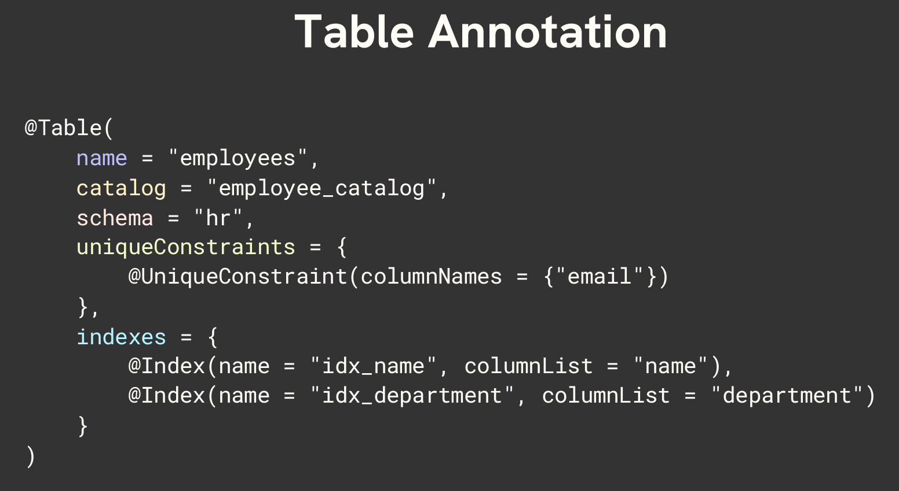

# 🚀 Coding Shuttle: Week 3 - Hibernate & Spring Boot Data JPA
Welcome to Week 3 of the Coding Shuttle course! In this week, we will cover the below-mentioned topics.

# 📚 Topics Covered in Week 3
1. Installation MySQL & DBeaver
2. Hibernate
3. Spring Data JPA
4. Creating Dynamic Query Methods
5. Sorting and Pagination
6. Data Mappings - 1:1, 1:N, N:M

# Topic 1 - Installation MySQL & DBeaver

# Topic 2 - Hibernate ORM, JPA, Entities and Tables

## Hibernate 

Hibernate is a powerful, high-performance Object-Relational Mapping (ORM) framework that is widely used with Java. It provides a framework for mapping an object-oriented domain model to a relational database.

Hibernate is one of the implementations of the Java Persistence API (JPA), which is a standard specification for ORM in Java.


## JPA (Java Persistence API)

- JPA is a specification for object-relational mapping (ORM) in Java.
- It defines a set of interfaces and annotations for mapping Java objects to database tables and vice versa. 
- JPA itself is just a set of guidelines and does not provide any implementation. The implementation of JPA is provided by ORM frameworks such as Hibernate, EclipseLink, and OpenJPA.

### So Basically…

JPA Provides a standard for ORM in Java applications, ensuring that developers can switch between different JPA providers without changing their code.

and... 

Hibernate is one such JPA Provider. 

However...

Hibernate is a specific implementation of JPA and a powerful ORM framework on its own. It offers additional features and optimizations beyond the JPA specification, making it a popular choice for ORM in Java applications.


## Entity Annotation
Mentioned below is a comprehensive list of annotations commonly used in Spring Boot JPA to define and manipulate database entities. 

These annotations play a vital role in mapping Java objects to database tables and managing database operations.

[Read More](https://medium.com/@yadavsunil9699/a-comprehensive-guide-to-annotations-in-spring-boot-jpa-950a05b5eb1b)

- **`@Entity`**
- **`@Table`** 
- **`@Id`**
- **`@GeneratedValue(strategy = GenerationType.IDENTITY)`** 
- **`@Column(name = "name", nullable = false, length = 50)`** 
- **`@CreationTimestamp`** and **`@UpdateTimestamp`**

### Table Annotation
The @Table annotation provides four attributes, allowing you to override the name of the table, its catalogue, and its schema, and enforce unique constraints on columns in the table.



Refer to **`ProductEntity`** class and **`application.properties`** for implementation details.

## Key features of JPA

1. **`Entity Management`**: Defines how entities (Java objects) are persisted to the database.
2. **`Query Language`**: Provides JPQL (Java Persistence Query Language) for querying entities.
3. **`Transactions`**: Manages transactions, making it easier to handle database operations within a transactional context.
4. **`Entity Relationships`**: Supports defining relationships between entities (e.g., One-to-One, One-to-Many, Many-to-One, Many-toMany).


# Topic 3 - Hibernate ORM, JPA, Entities and Tables

## Spring Data JPA 

- Spring Data JPA is a part of the larger Spring Data family. 
- It builds on top of JPA, providing a higher-level and more convenient abstraction for data access. 
- Spring Data JPA makes it easier to implement JPA-based repositories by providing boilerplate code, custom query methods, and various utilities to reduce the amount of code you need to write.

#### Inheritance Tree of JPA


## Key features of Spring Data JPA 
1. **Repository Abstraction:** Provides a Repository interface with methods for common data access operations. 
2. **Custom Query Methods:** Allows defining custom query methods by simply declaring method names. 
3. **Pagination and Sorting:** Offers built-in support for pagination and sorting. 
4. **Query Derivation:** Automatically generates queries from method names.

## Rules for Creating Query Methods


1. The name of our query method must start with one of the following prefixes: find...By, read...By, query...By, and get...By. Examples: **`findByName, readByName, queryByName, getByName`**
2. If we want to limit the number of returned query results, we can add the First or the Top keyword before the first By word. Examples: **`findFirstByName, readFirst2ByName, findTop10ByName`**
3. If we want to select unique results, we have to add the Distinct keyword before the first By word. Examples: **`findDistinctByName or findNameDistinctBy`**
4. Combine property expression with AND and OR. Examples: **`findByNameOrDescription, findByNameAndDescription`**

[List of all JPA Query Keywords](https://docs.spring.io/spring-data/jpa/reference/repositories/query-keywords-reference.html)

You can either use JPQL or write your own custom queries as detailed in **`ProductRepository`** class.

Kindly refer to **`ProductRepository`** & **`W3P3JpaTutorialApplicationTests`** classes for implementation details.

# Topic 4 - Sorting & Pagination

**Sorting** - Sorting allows you to order the records based on the one or more fields. It is useful when you need to present the data in a specific order, such as sorting the products by price or name.

### Sorting with method queries

```java
// OrderBy
@Repository
public interface EmployeeRepository extends JpaRepository<Employee, Long> { 
    List<Employee> findAllByOrderByNameAsc(); List<Employee> findAllByOrderByNameDesc(); 
}
```
### Sorting with the Sort class

```java
// Sort Parameter In Query Methods 
@Repository 
public interface EmployeeRepository extends JpaRepository<Employee, Long> { 
    List<Employee> findByDepartment(String department, Sort sort); 
} 

// Using the Sort class
Sort sort = Sort.by(Sort.Direction.ASC, sortField); 
Sort sort = Sort.by(Sort.Order.asc("name"), Sort.Order.desc("salary"));
```

### Pagination 
Pagination refers to the process of dividing a large dataset into smaller chunks or pages of the data. It allows the users to navigate through the subsets of the data rather than loading all data at once, which can be inefficient and slow.
- **Page:** A single chunk of data that contains a subset of the total dataset. It is an interface representing a page of data, including information about the total number of pages, total number of elements, and the current page's data. 
- **Pageable:** An interface that provides pagination information such as page number, page size, and sorting options. 
- **PageRequest:** A concrete implementation of Pageable that provides methods to create pagination and sorting information.

Kindly refer to **`ProductController`** & **`ProductRepository`** classes for implementation details.
