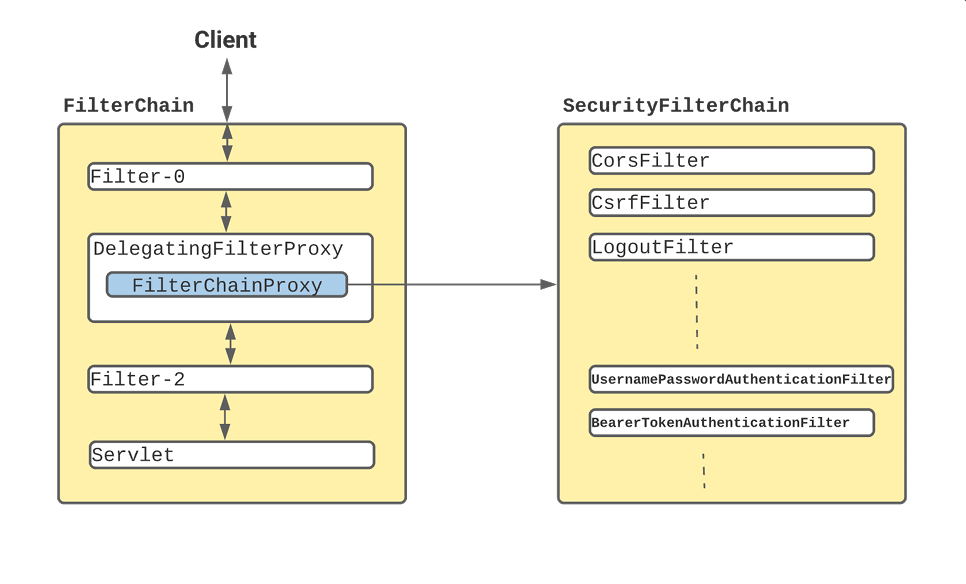
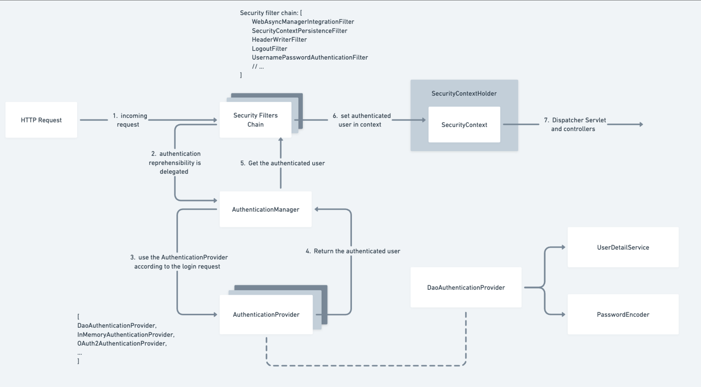

# 🚀 Coding Shuttle: Week 5 (PART 1) - Spring Security

Welcome to Week 5 of the Coding Shuttle course! This week, we dive into security features of Spring Boot. Below are the topics we will cover:

---

# 📚 Topics Covered in Week 5
1. Types of Security Attacks
2. Internal Working of Spring Security & Core Spring Security Components
3. Configuring default SecurityFilterChain
4. Understanding JWT
5. Login/SignUp using JWT
6. Authenticating requests using JWT
7. Spring Security Exception Handling

---

# 1. Web Security Vulnerabilities: CSRF, XSS, and SQL Injection

This document provides detailed information about three common web security vulnerabilities: Cross-Site Request Forgery (CSRF), Cross-Site Scripting (XSS), and SQL Injection. Each vulnerability is explained with its definition, impacts, and mitigation strategies, along with examples.

---

## 1. Cross-Site Request Forgery (CSRF)

### Definition
CSRF is a type of attack that tricks a user into executing unintended actions on a web application in which they are authenticated. This attack leverages the trust that the web application has in the user's browser.

### How It Works
1. A user logs into a web application.
2. The attacker tricks the user into clicking on a malicious link or visiting a malicious site.
3. The malicious request is sent to the web application using the user’s session cookies.
4. The web application processes the request as if it were legitimate.

### Example
```html
<!-- Malicious HTML -->

```
- If a logged-in user visits the attacker’s page, their browser will send a request to `example.com` to delete their account.

### Mitigation
- Use anti-CSRF tokens: Include unique tokens in forms and validate them on the server side.
- Implement SameSite cookies: Ensure cookies are only sent with requests originating from the same site.
- Require re-authentication for sensitive actions.
- Validate the `Referer` and `Origin` headers.

---

## 2. Cross-Site Scripting (XSS)

### Definition
XSS is an injection attack where malicious scripts are injected into trusted web applications. The malicious script is executed in the browser of a victim, potentially compromising their data or accounts.

### Types of XSS
1. **Stored XSS**: The malicious script is permanently stored on the server (e.g., in a database).
2. **Reflected XSS**: The malicious script is embedded in a URL and reflected back in the response.
3. **DOM-Based XSS**: The attack occurs in the client-side JavaScript without involving the server.

### Example
**Vulnerable Code:**
```html
<p>Welcome, <script>document.write(location.search.split('=')[1]);</script>!</p>
```
**Exploit:**
```
https://example.com?name=<script>alert('Hacked');</script>
```
- When the link is visited, an alert box will be displayed, indicating the script was executed.

### Mitigation
- Sanitize inputs: Escape or remove dangerous characters before processing.
- Use content security policy (CSP): Restrict the sources from which scripts can be loaded.
- Encode outputs: Encode data before rendering it in the browser (e.g., HTML entity encoding).
- Avoid using `eval()` and similar functions.

---

## 3. SQL Injection

### Definition
SQL Injection is a vulnerability where an attacker manipulates SQL queries by injecting malicious SQL code into input fields. This can lead to unauthorized data access or database manipulation.

### How It Works
1. An application takes user input and inserts it directly into an SQL query.
2. The attacker crafts malicious input that modifies the SQL query’s logic.

### Example
**Vulnerable Code:**
```sql
SELECT * FROM users WHERE username = '" + username + "' AND password = '" + password + "';
```
**Malicious Input:**
```
username: ' OR 1=1 --
password: anything
```
**Resulting Query:**
```sql
SELECT * FROM users WHERE username = '' OR 1=1 --' AND password = 'anything';
```
- This query always returns true, potentially granting unauthorized access.

### Mitigation
- Use parameterized queries or prepared statements.
- Avoid dynamic SQL: Do not concatenate user input directly into SQL queries.
- Validate inputs: Restrict input to expected formats and lengths.
- Use stored procedures: Encapsulate SQL logic within database procedures.
- Limit database permissions: Ensure the application’s database user has only the necessary privileges.

---

## Conclusion
CSRF, XSS, and SQL Injection are critical vulnerabilities that can compromise the security of web applications. Developers should employ robust validation, encoding, and security mechanisms to mitigate these risks and protect user data.

---

# 2. Internal Working of Spring Security & Core Spring Security Components

This document provides an overview of Spring Security's internal workings, including key concepts like Authentication and Authorization, default behaviors, and its internal flow. Diagrams are used to simplify understanding.

---

## Adding Spring Security

To include Spring Security in a Spring Boot application, you only need to add the following dependency:

```xml
<dependency>
    <groupId>org.springframework.boot</groupId>
    <artifactId>spring-boot-starter-security</artifactId>
</dependency>
```

Spring Boot auto-configures security defaults through the `WebSecurityConfiguration` class.

---

## Key Concepts

### 1. Authentication
- **Definition**: The process of verifying the identity of a user (e.g., checking username and password).
- **Purpose**: Ensures that the user is who they claim to be.

### 2. Authorization
- **Definition**: Determines what an authenticated user can do.
- **Purpose**: Controls access to resources and actions based on user permissions.

---

## Internal Working of Spring Security

### 1. Request Flow in Spring Security
   * When a user sends a request to a Spring application secured by Spring Security, here's what happens step-by-step:
   1. **`Request Interception:`**
      * Every incoming HTTP request is intercepted by a special filter called the springSecurityFilterChain.
      This chain contains multiple security filters (e.g., authentication, authorization, CSRF, etc.) that process the request.
   2. **`Authentication:`**
      * If the request is for a protected resource, Spring Security checks if the user is authenticated.
      * If the user is not authenticated, they are redirected to a login page or prompted for credentials (e.g., HTTP Basic Auth).
   3. **`Authorization:`**
      * Once authenticated, Spring Security checks if the user has the necessary permissions (roles) to access the requested resource.
      * If the user does not have the required role, an Access Denied error is returned.
   4. **`Response:`**
      * If all checks pass, the request proceeds to the application, and the appropriate response is sent back to the user.



2. Components in the Internal Flow
   1. **`Security Filters:`**
      * A series of filters form the springSecurityFilterChain. Common filters include:
        * **`Authentication Filter:`** Handles user login and credential validation.
        * **`Authorization Filter:`** Ensures the user has permission to access the requested resource.
        * **`CSRF Filter:`** Protects against cross-site request forgery attacks.
        * **`Logout Filter:`** Handles user logout.
   2. **`Authentication Manager:`**
      * The central component responsible for validating user credentials.
      * Delegates to specific authentication providers (e.g., in-memory, database, LDAP).
   3. **`Access Decision Manager:`**
      * Decides whether a user has access to a resource based on their roles and permissions.
   4. **`Security Context:`**
      * A storage mechanism that holds information about the currently authenticated user (e.g., username, roles).
      * This information is used across the application to enforce security rules.
   5. **`UserDetailsService:`**
      * A service used to load user-specific data, such as username, password, and roles, typically from a database or in-memory store.



---
## Default Behavior of Spring Security

1. **Filter Registration**: Registers a filter with the name `springSecurityFilterChain` for all requests.
2. **Authentication**:
   - Default login form generation.
   - HTTP Basic Authentication.
   - Default user credentials:
      - Username: `user`
      - Password: Logged to the console.
3. **Password Storage**:
   - Uses `BCrypt` for password encryption.
4. **CSRF Protection**:
   - Enabled by default.
5. **Logout**:
   - Provides a default logout mechanism.

---
## Conclusion

Spring Security simplifies implementing robust security in Spring Boot applications. Understanding its default behaviors and internal flow helps developers effectively customize and leverage its features.

# 3. Configuring default SecurityFilterChain
# WebSecurityConfig Class: Overview and Capabilities

The `WebSecurityConfig` class is a key component in securing a Spring Boot application. It leverages the `@Configuration` and `@EnableWebSecurity` annotations to configure and enable Spring Security features. This file provides an overview of the primary goals and capabilities offered by the `WebSecurityConfig` class.

---

## Primary Goal
The primary goal of the `WebSecurityConfig` class is to define and manage the security configurations for a Spring Boot application. It handles:

1. **Authentication**: Ensures that users can prove their identity (e.g., via login credentials).
2. **Authorization**: Controls access to application resources based on user roles and permissions.
3. **Security Filters**: Configures the chain of filters that intercept HTTP requests to enforce security policies.
4. **Password Encoding**: Secures user credentials with modern hashing algorithms.

---

## Capabilities Offered by WebSecurityConfig

### 1. **Custom Security Configuration**
The class allows defining custom security rules for different HTTP endpoints. For example:
- Public routes that can be accessed without authentication.
- Restricted routes that require specific roles or permissions.

### 2. **Authentication Mechanisms**
The class enables various authentication mechanisms:
- **Form-Based Login**: Presents a login form for user authentication.
- **HTTP Basic Authentication**: Useful for API clients like Postman.

### 3. **UserDetailsService Configuration**
The class defines user details for authentication purposes:
- In-memory user details for testing and development.
- Custom implementations for integrating with databases or external services.

### 4. **Password Encoding**
Configures a secure password encoder, such as `BCryptPasswordEncoder`, to hash passwords before storing them.

### 5. **Session Management**
Manages user sessions to control how authentication information is stored and shared across requests:
- Enables session creation policies (e.g., `IF_REQUIRED`, `STATELESS`).

### 6. **Security Filters**
The class configures and enables a chain of security filters that:
- Intercept and process HTTP requests.
- Apply security policies like authentication, authorization, and CSRF protection.

### 7. **Role-Based Access Control**
Supports fine-grained control of resource access based on user roles. For example:
- Restrict access to specific endpoints to users with roles like `ADMIN` or `USER`.

### 8. **Customizable Behavior**
The class provides hooks to extend or override default Spring Security behaviors:
- Custom login pages.
- Integration with third-party identity providers (e.g., OAuth2).
- Defining custom authentication or authorization logic.
---
## Conclusion
The `WebSecurityConfig` class is a foundational component for securing Spring Boot applications. By leveraging its capabilities, developers can:
- Protect endpoints and resources.
- Manage user authentication and authorization.
- Configure robust security policies tailored to application needs.

For production environments, the class can be extended to include database-backed user stores, integration with identity providers, and advanced security mechanisms like OAuth2 or JWT-based authentication.

---

# 4. Why Use JWT (JSON Web Token)?

JWT (JSON Web Token) is a widely used standard for secure, stateless communication between parties. Here’s why it’s beneficial:

## Key Benefits

1. **Stateless Authentication**:
   - No server-side session storage needed; token validation is self-contained.

2. **Compact and Portable**:
   - Lightweight format (Base64 encoded) for easy transmission via HTTP headers, cookies, or query params.

3. **Secure and Tamper-Proof**:
   - Digitally signed using HMAC or RSA/ECDSA to ensure data integrity and authenticity.

4. **Self-Contained**:
   - Encodes all required user information (e.g., roles, permissions, expiration) in the payload.

5. **Built-In Expiry**:
   - Tokens expire automatically, reducing misuse risks.

6. **Cross-Origin Support**:
   - Works seamlessly in CORS-enabled environments.

7. **Interoperability**:
   - Language-agnostic and supported by most frameworks.

## Common Use Cases

- **Authentication**: Verify user identity with a stateless mechanism.
- **Authorization**: Embed roles/permissions to control resource access.
- **Single Sign-On (SSO)**: One token for accessing multiple services.
- **Information Exchange**: Secure data sharing between parties.

## Example Flow
1. User logs in and receives a JWT.
2. The JWT is sent with each request (e.g., in the Authorization header).
3. The server validates the token and grants/denies access.

## Challenges
- Revocation is non-trivial (requires blacklisting).
- Sensitive to secret/private key security.
- Token size can grow with additional claims.

## Conclusion
JWT is ideal for scalable, stateless authentication and secure data exchange, provided proper security practices are followed.