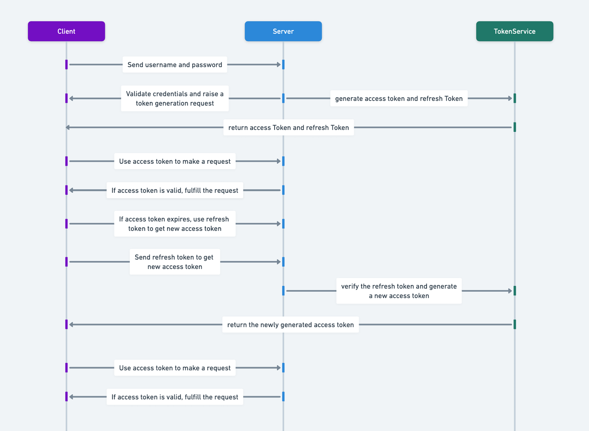
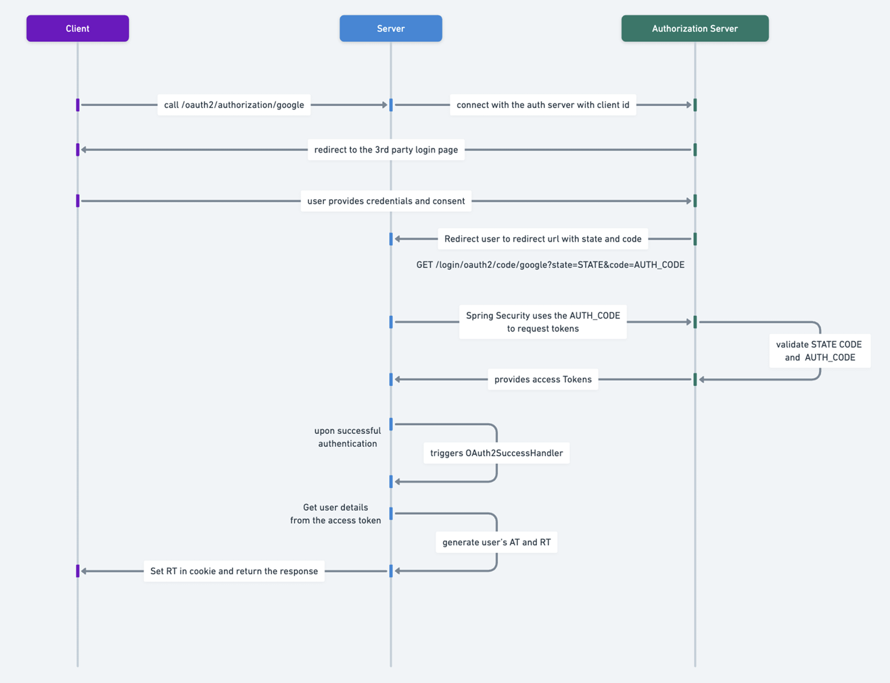

# 🚀 Coding Shuttle: Week 6 - Advanced Spring Security

Welcome to Week 6 of the Coding Shuttle course! This week, we dive into ADVANCED features of Spring Security. Below are the topics we will cover:

---

# 📚 Topics Covered in Week 6
1. Refresh Token vs Access Token
2. Google OAuth2 Client Authentication in Spring Security
3. User Session management using JWT

---

# 1. Refresh Token vs Access Token

## Issues with JWT Access Tokens

#### 1. Increased Risk with Long-Lived Tokens
If an access token is used for an extended period, its exposure in requests increases the risk of it being intercepted or misused. Short-lived tokens reduce this risk by limiting how long a stolen token can be exploited. However, short-lived tokens alone are not a complete solution.

#### 2. Frequent Reauthentication Disrupts User Experience
Since access tokens are typically short-lived, users may need to reauthenticate frequently if a refresh token mechanism is not implemented. This can disrupt the user experience and reduce overall convenience.

---

### Solution: Two-Token Approach
To address these challenges, a two-token approach is recommended:

#### 1. Access Token
- **Purpose**: Grants short-term access to protected resources.
- **Characteristics**: Short-lived to minimize risk if intercepted. Typically stored in memory or as a client-side variable.

#### 2. Refresh Token
- **Purpose**: Used to obtain a new access token when the old one expires.
- **Characteristics**: Long-lived and securely stored (e.g., in HTTP-only cookies). Only transmitted during the token renewal process, reducing its exposure.

---

By combining access tokens for frequent, secure resource access and refresh tokens for extended user sessions, this approach ensures both security and convenience in JWT-based authentication systems.



# Access Token and Refresh Token Implementation in Spring Boot

This document provides a step-by-step explanation of implementing access tokens and refresh tokens in a Spring Boot application to ensure secure and efficient authentication mechanisms.

## Overview

1. **Access Token**: A short-lived token used for accessing protected resources.
2. **Refresh Token**: A long-lived token used to obtain a new access token when the old one expires.

The application uses Spring Boot with JWT (JSON Web Token) for token-based authentication.

---

## Implementation Steps

### 1. Implement `AuthController`

The `AuthController` provides endpoints for user signup, login, and token refresh.

#### Key Endpoints:

- **`/auth/signup`**: Allows users to create an account.
- **`/auth/login`**: Authenticates the user and provides access and refresh tokens.
- **`/auth/refresh`**: Generates a new access token using the refresh token stored in cookies.

### 2. Create necessary methods in `AuthService`

The `AuthService` handles user login and token refresh logic. In our case, we have created two methods `login()` and `refreshToken` which help generate access/refresh token and return that in `LoginResponseDto` format.

### 3. Implement the `JwtService`

The `JwtService` generates and validates JWTs. In our case, we have added 2 new methods namely `generateAccessToken()` and `generateRefreshToken()` that help generate Jwt tokens with data and expiration dates.

### 4. Test the Application

Please test the application using `/auth/login` and  `/auth/refresh` API's. Reduce the expiry time of access and refresh token for the purpose of testing.

---

# 2. Google OAuth2 Client Authentication in Spring Security

This section explains how Google OAuth2 authentication works using your code implementation as a reference.

## Workflow of Google OAuth2 Authentication
Google OAuth2 is an authentication mechanism that allows users to log in using their Google account. It involves the following steps:



## Key Components in Your Implementation

### 1. **Security Configuration**

The `WebSecurityConfig` class configures security settings and integrates OAuth2 login.

```java

public class WebSecurityConfig {

    private final OAuth2SuccessHandler oAuth2SuccessHandler;

    @Bean
    SecurityFilterChain securityFilterChain(HttpSecurity httpSecurity) throws Exception {
        httpSecurity
                ...
                .oauth2Login(oauth2Config -> oauth2Config
                        .failureUrl("/login?error=true")
                        .successHandler(oAuth2SuccessHandler)
                );
        return httpSecurity.build();
    }
}
```
- **OAuth2 Success Handler**: The `oAuth2SuccessHandler` processes successful authentication requests.
- **JWT Authentication**: The `JwtAuthFilter` validates JWTs for secured routes.

### 2. **OAuth2SuccessHandler**

The `OAuth2SuccessHandler` handles successful authentication by:
- Retrieving user details from Google.
- Checking if the user exists in the local database; if not, creating a new user.
- Generating JWT access and refresh tokens.
- Redirecting to the frontend with the access token.

(
Replace below details - 
- gcid: 451477101490-0mk13k8vhj3e1rbp4mrsuk6915cv86ui.apps.googleusercontent.com
- gcs: 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
)
---

# 3. User Session management using JWT

User session management refers to the practice of maintaining and controlling user interactions with an application over a period of time. It involves tracking and managing user login sessions, ensuring security, and providing a seamless user experience.

---

## JWT Session management:
1. Generate ACCESS-TOKEN + REFRESH-TOKEN and store the Session using this schema 
   - `(session_id, refreshToken, userId, lastUsedAt)`
2. When renewing ACCESS-TOKEN using REFRESH-TOKEN
   - if REFRESH-TOKEN is not expired AND the session is present, return ACCESS-TOKEN
   - if session is NOT present, return Exception
3. Upon a New Login request, check if the session limit is full. 
   - if full -> remove the least recently used session 
   - else -> Follow step 1

---
## Session Workflow


---

## Components and Logic

### 1. **SessionService**
Handles session generation and validation logic.

#### **Methods**:

- **`generateNewSession(User user, String refreshToken)`**:
    - Creates a new session for the user.
    - If the user exceeds the session limit (default: 2), deletes the least recently used session.
    - Saves the new session to the database.

- **`validateSession(String refreshToken)`**:
    - Checks if the provided refresh token exists in the database.
    - Updates the `lastUsedAt` timestamp for the session if valid.
    - Throws `SessionAuthenticationException` if the session is invalid.

---

### 2. **SessionRepository**
A JPA repository for managing session entities in the database.

---

### 3. **Session Entity**
Defines the `Session` object with attributes such as `refreshToken`, `lastUsedAt`, and a relationship with the `User` entity.

---

### 4. **AuthService**
Handles authentication, session generation, and token-based authorization.

#### **Methods**:

- **`login(LoginDto loginDto)`**:
    - Authenticates the user using `AuthenticationManager`.
    - Generates access and refresh tokens.
    - Creates a new session using `SessionService.generateNewSession()`.

- **`refreshToken(String refreshToken)`**:
    - Validates the refresh token using `SessionService.validateSession()`.
    - Generates a new access token.
    - Fails to create refreshToken if session data does not exist

---

## Summary
This implementation ensures:
- **Session Limitation**: Prevents users from exceeding a predefined number of active sessions.
- **Session Validation**: Validates and updates session activity for secure refresh token usage.
- **Scalability**: Easily extendable to support more advanced session management features.